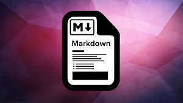

# my-first-repo

## About myself

**My name is Issa Zeidan I am 28 years old, I live in Zarqa, I am looking to grow my programming knowledge and turn it to a great experience as I am a tech follower since 2009 until today and I had a multiple experience in a different fields such as travel agencies, hotels and customer support.**

### What I will learn?

+ I will learn Markdown language
+ I will create my first repo using the Markdown language

### What is Markdown language?

Markdown is a lightweight markup language that you can use to add formatting elements to plaintext text documents. Created by John Gruber in 2004, Markdown is now one of the world’s most popular markup languages.
As You can add Markdown formatting elements to a plaintext file using a text editor application. Or you can use one of the many Markdown applications for macOS, Windows, Linux, iOS, and Android operating systems. There are also several web-based applications specifically designed for writing in Markdown.

Depending on the application you use, you may not be able to preview the formatted document in real time. But that’s okay. According to Gruber, Markdown syntax is designed to be readable and unobtrusive, so the text in Markdown files can be read even if it isn’t rendered.

> ***Be aware that The overriding design goal for Markdown’s formatting syntax is to make it as readable as possible. The idea is that a Markdown-formatted document should be publishable as-is, as plain text, without looking like it’s been marked up with tags or formatting instructions.***

### Why we use Markdown?

+ Markdown can be used for everything. People use it to create websites, documents, notes, books, presentations, email messages, and technical documentation.

+ Markdown is portable. Files containing Markdown-formatted text can be opened using virtually any application. If you decide you don’t like the Markdown application you’re currently using, you can import your Markdown files into another Markdown application. That’s in stark contrast to word processing applications like Microsoft Word that lock your content into a proprietary file format.

+ Markdown is platform independent. You can create Markdown-formatted text on any device running any operating system.

+ Markdown is future proof. Even if the application you’re using stops working at some point in the future, you’ll still be able to read your Markdown-formatted text using a text editing application. This is an important consideration when it comes to books, university theses, and other milestone documents that need to be preserved indefinitely.

+ Markdown is everywhere. Websites like Reddit and GitHub support Markdown, and lots of desktop and web-based applications support it.

** As you notice there is a differences between the lines as I used the " *** " in order to make the text bold and Italic also I used " # " to make the header and I used the ">" to create a Blockquotes, For the bold-dots I used "+" sign and in order to add a link to your project in Markdown language and allow it to open in a new tap you can use this method :  as Markdown syntax for links doesn’t allow you to specify the target attribute, but if your Markdown processor supports HTML, you can use HTML to create these links.

>**For more syntax you can visit this link**: <a href="https://www.markdownguide.org/basic-syntax#images-1" target="_blank">Learn Markdown!</a>
